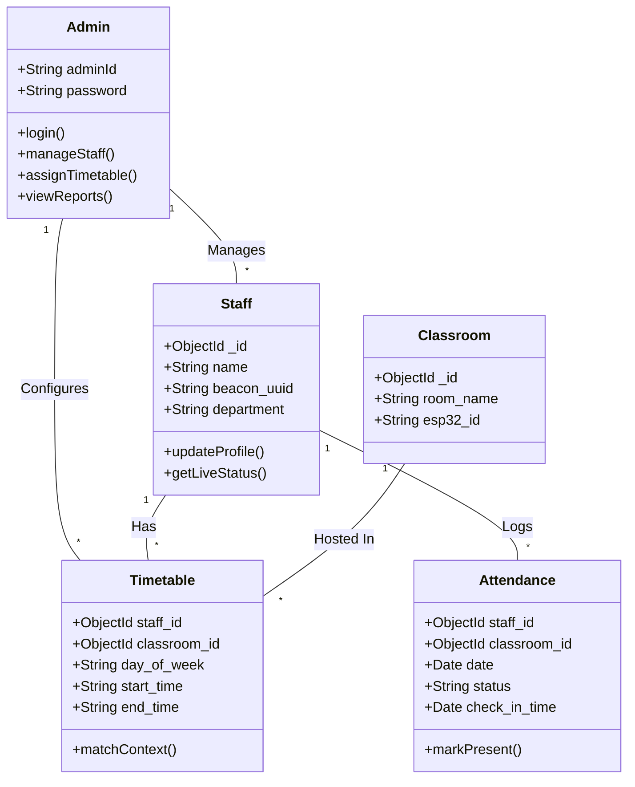
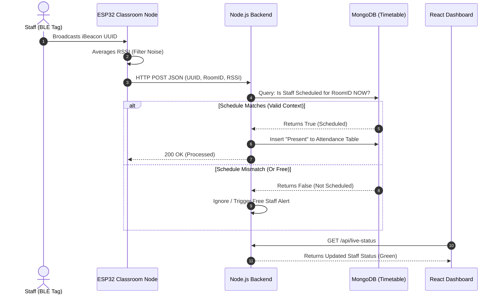
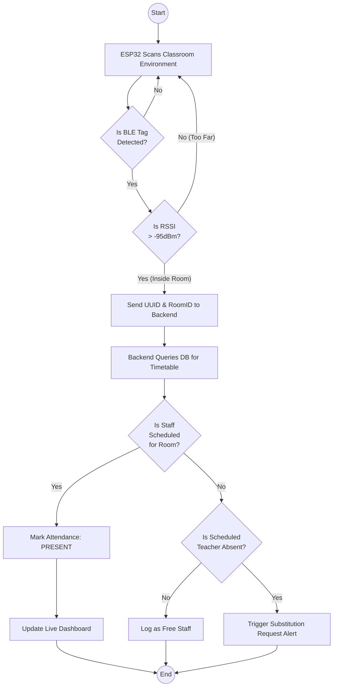

# UML Diagrams: Context-Aware Indoor Staff Presence Verification Using BLE

This document contains clear descriptions and **Mermaid.js code** for the four major UML diagrams required for your project. You can copy the code blocks below and paste them into any AI tool (like ChatGPT) or directly into [Mermaid Live Editor](https://mermaid.live/) to instantly generate beautiful, high-quality images for your Overleaf project.

---

## 1. Use Case Diagram
**Purpose**: Shows the interactions between the main users (Actors) and the system.
**Actors**: Admin, Staff, ESP32 Receiver (Hardware Actor).

### Description to tell the AI:
*"Create a Use Case diagram where the Admin can Add Staff, Assign Timetables, and View Reports. The Staff carries a BLE Tag. The ESP32 Receiver actively Scans the Tags and Forwards the Data constraint to the Backend System which Checks the Timetable and Marks Attendance."*

### Mermaid Code:
```mermaid
usecaseDiagram
    actor Admin as "Administrator"
    actor Staff as "Staff (Carries BLE Tag)"
    actor ESP32 as "ESP32 BLE Receiver"

    package "Staff Presence Verification System" {
        usecase UC1 as "Manage Staff Profiles"
        usecase UC2 as "Configure Timetables"
        usecase UC3 as "View Live Dashboard"
        usecase UC4 as "Broadcast BLE Signal"
        usecase UC5 as "Scan Proximate Tags"
        usecase UC6 as "Context-Aware Verification"
        usecase UC7 as "Log Attendance"
        usecase UC8 as "Send Substitution Alert"
    }

    Admin --> UC1
    Admin --> UC2
    Admin --> UC3
    
    Staff --> UC4
    
    ESP32 --> UC5
    UC4 .-> UC5 : "Detects Signal"
    
    UC5 --> UC6
    UC6 --> UC7 : "If Schedule Matches"
    UC6 --> UC8 : "If Conflict Found"
```

---

## 2. Class Diagram
**Purpose**: Represents the structure of the system through classes, their attributes, and relationships.

### Description to tell the AI:
*"Draw a Class Diagram for a Node.js/MongoDB backend. The main classes are Admin, Staff, Classroom, Timetable, and Attendance. Staff has a 1-to-Many relationship with Timetable and Attendance. Admin manages Staff and Timetables."*

### Mermaid Code:


---

## 3. Sequence Diagram
**Purpose**: Shows the step-by-step time sequence of how a staff member walks into a room and gets marked present.

### Description to tell the AI:
*"Generate a Sequence Diagram. Staff enters the room with a Tag. ESP32 detects the tag and sends HTTP POST to the Backend. Backend queries MongoDB for the Timetable. If scheduled, Backend writes Attendance. Dashboard fetches the update via API."*

### Mermaid Code:


---

## 4. Activity Diagram
**Purpose**: Shows the flow of execution from the system's start to the end.

### Description to tell the AI:
*"Create an Activity flow chart. Start. ESP32 Scans BLE. Is RSSI stronger than threshold? If No, Ignore. If Yes, send to Server. Server checks Timetable. Does Schedule Match? If Yes, Mark Present. If No: Is Teacher Absent? If Yes, send Substitution Alert. End."*

### Mermaid Code:

